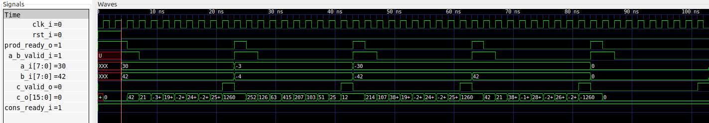
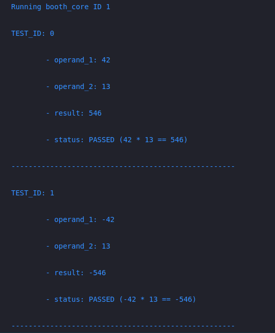

# Booth's multiplication algorithm



# Implementation on the KRIA KV260 Board
## Block design


## Address Map
### Base address 
APB4_BOOTH_BASEADDR  =  0xA0000000
### Registers

|REGISTER | ADDRESS OFFSET|  
|---------|---------------|
|APB4_BOOTH_OP_1 |   0x00 | 
|APB4_BOOTH_OP_2 |   0x04 | 
|APB4_BOOTH_RES  |   0x08 | 
|APB4_BOOTH_CTRL |   0x0C | 
|APB4_BOOTH_STAT |   0x10 | 
|APB4_BOOTH_ID   |   0x14 | 

## Tests ([code](fpga/sw/booth_main.c))
```
...
    test_booth_core(0, +42, +13);  
    test_booth_core(1, -42, +13); 
    test_booth_core(2, +42, -13);
    test_booth_core(3, -42, -13);
...
```
## Output
 

